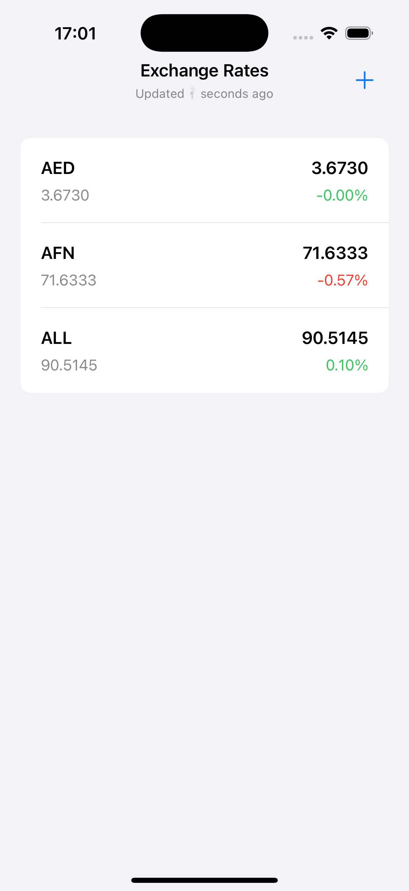
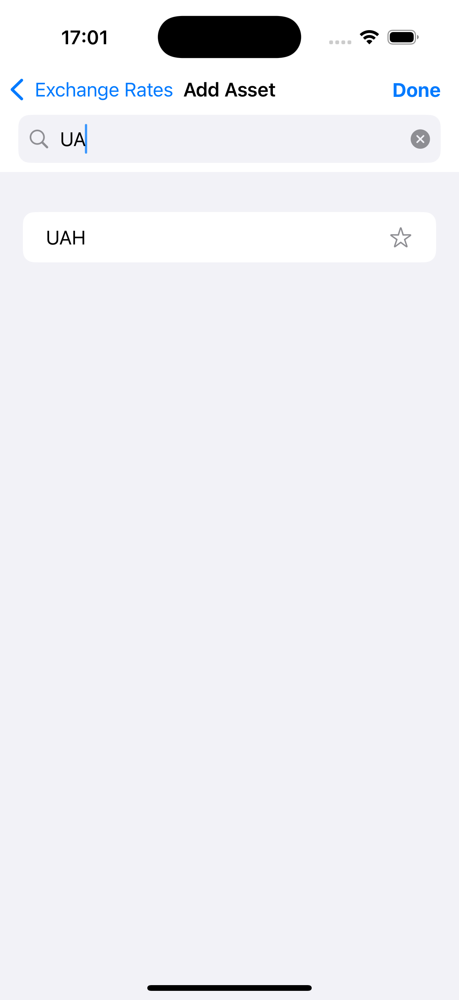
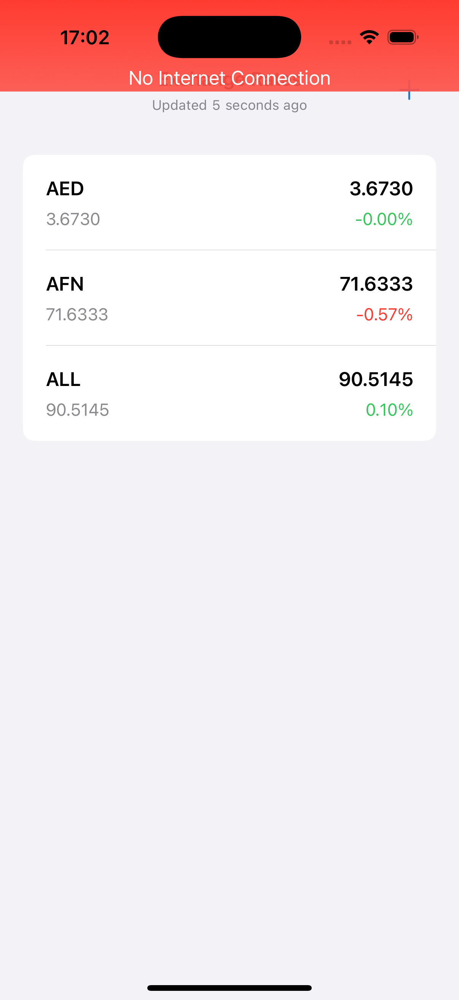
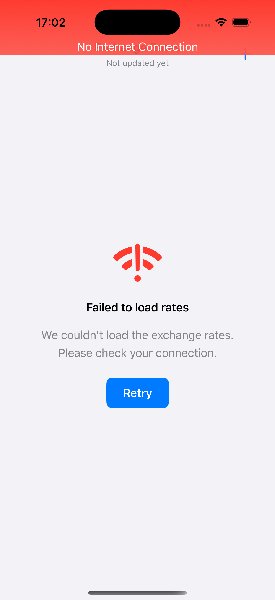

# CurrencySync

This mobile application displays real-time exchange rates for a list of selected currencies. Users can add and remove currencies from their personalized board, with prices updating automatically in near real-time.

## Features

- **Home Screen**: Displays a list of selected currencies and their current exchange rates that auto-update every 3-5 seconds
- **Add Asset Screen**: Searchable screen to browse and add available currencies to your board
- **Remove Assets**: Ability to remove currencies from your list
- **Persistent Storage**: Selected assets persist between app sessions
- **Network Monitoring**: Displays a notification when internet connection is lost

## API Used

The application uses [Exchangerate.host API](https://api.exchangerate.host) to fetch currency exchange rates.

- **Endpoint**: `/change`
- **API Key**: Application uses an API key for authentication
- **Request Example**: `https://api.exchangerate.host/change?access_key=YOUR_API_KEY&currencies=USD,EUR,GBP`

## Setup Instructions

1. Clone the repository:
   ```
   git clone https://github.com/andrewchkrn/CurrencySync.git
   cd CurrencySync
   ```

2. Open the project in Xcode

3. Build and run the application on your preferred simulator or device.

## Project Architecture

The project follows the **MVVM+Coordinator** architecture pattern:

- **Model**: Data structures and business logic
- **View**: SwiftUI views rendering the UI
- **ViewModel**: Processes and prepares data for the views
- **Coordinator**: Manages navigation flow using FlowStack

### Key Components

- **ExchangerRouter**: API routing setup with proper endpoint configuration
- **FavoritesManager**: Manages user's favorite currencies with persistent storage
- **MonitorConnection**: Tracks internet connectivity status
- **Network Layer**: Built using clean architecture principles with URLSession

## Technical Details

- **Language**: Swift 6
- **UI Framework**: SwiftUI
- **Networking**: URLSession
- **Navigation**: FlowStack
- **Storage**: Local persistence for favorites
- **Testing**: Unit tests for FavoritesManager

## Assumptions Made

1. **Default Currencies**: At first launch, the app shows default currencies (USD, GBP, EUR)
2. **Network Connectivity**: The app handles offline scenarios by displaying the last known rates
3. **API Limitations**: Free tier of the API may have rate limiting which is handled gracefully
4. **Device Support**: The app is optimized for iOS devices running iOS 17 and above
5. **User Experience**: Focused on simple, clean UI rather than complex animations

## Future Improvements

With additional time, the following enhancements could be made:

- Add more extensive unit and UI tests
- Implement more refined animations for rate updates
- Add historical rate charts for each currency
- Implement dark mode support
- Add favorite currency sorting options
- Support for additional API providers as fallbacks

## Screenshots





